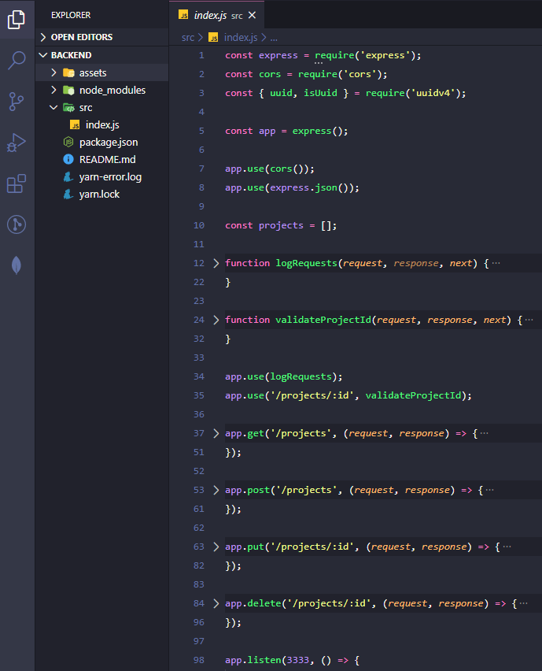

# :gear: Backend with Node.js

A simple RestFull API made with Node.js to practice CRUD operations.

This project stores a list of projects in memory and provide an Express API to: list, create, update and delete projects;

<p align="center">
  
</p>

### :keyboard: Installation and Execution

- Clone this repo

```
> git clone https://github.com/prenato84/backend-node-module
```

- Go inside the project's main folder

```
> cd backend-node-module
```

- Install the dependencies

```
npm install
```

- Run the projecy

```
npm dev
```

### :bookmark_tabs: API Description

Getting the projects list (GET Method at the URL)

> http://localhost:3333/projects

    It returns the total count of projects (X-Total-Count) inside the Http Header

Adding a project (POST Method at the URL)

> http://localhost:3333/projects

    The JSON Object:
    {
      title: `New Project ${Date.now()}`,
      owner: 'Owner Name',
    }

---

- **`GET /projects`**: list of all projects in memory;

- **`POST /projects`**: expects to receive an object with `title` and `owner` inside the request body. The created project is stored inside an object like: `{ id: "uuid", title: 'Node.js Project', owner: 'Owner Name'`; The ID is an UUID - Universal Unique Identifier.

- **`PUT /projects/:id`**: expects to receive an object with `title` and `owner` inside the request body and it changes the project info based on the `id` passed as a request param;

- **`DELETE /projects/:id`**: deletes the project that corresponds to the `id` passed as a request param;

### :man_technologist: Requirements

- Javascript interpreter **[Node JS](https://nodejs.org/en/download/)**
- Version control system **[Git](https://git-scm.com/)**

OBS: if you don't want to use Git, you can download the project's zip file directly from the Project's GitHub Page as shown below:

<p align="center">
  
</p>

### :memo: License

This project is under the MIT license.

---

Developed with 💜 by <a href="https://www.linkedin.com/in/prenato84">Paulo Castro</a> :wave:
